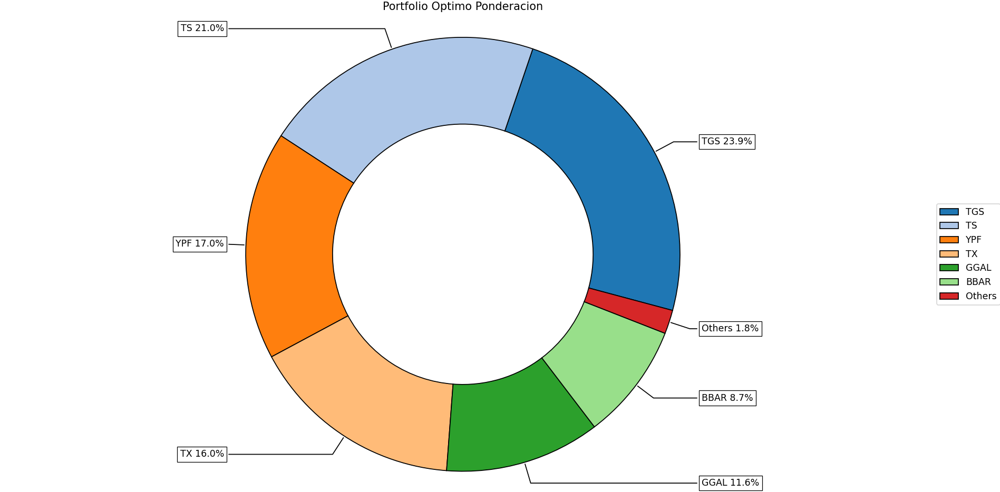

# Uso de Python Aplicado al Mercado Argentino

Este proyecto implementa un modelo de optimización de portafolios financieros utilizando Python. Se basa en la descarga de datos históricos de precios de acciones, el cálculo de rendimientos y la optimización de la asignación de activos para maximizar el ratio de Sharpe.

## Requisitos

Para ejecutar este proyecto, asegúrate de instalar las dependencias listadas en el archivo `requirements.txt`. Puedes instalarlas ejecutando:

```bash
pip install -r requirements.txt
```

## **Archivos Principales**

- **`frontera.py`**: Contiene el código principal para la optimización del portafolio.
- **`requirements.txt`**: Lista de dependencias necesarias para el proyecto.
- **`.gitignore`**: Excluye el entorno virtual `myenv` del control de versiones.

## **Descripción del Código**

El script `frontera.py` realiza los siguientes pasos:

1. **Importación de Librerías**: Se utilizan librerías como `numpy`, `pandas`, `matplotlib`, `yfinance` y `riskfolio` para manejar datos financieros y realizar la optimización.
2. **Descarga de Datos**: Se descargan datos históricos de precios de acciones de empresas argentinas utilizando `yfinance`.
3. **Cálculo de Rendimientos**: Se calculan los rendimientos diarios a partir de los precios de cierre.
4. **Optimización del Portafolio**:
    - Se define un modelo clásico de optimización.
    - Se utiliza el método histórico para calcular la media y la covarianza de los rendimientos.
    - Se optimiza el portafolio para maximizar el ratio de Sharpe.
5. **Visualización**: Se genera un gráfico de pastel que muestra la ponderación óptima de los activos en el portafolio.

## **Ejecución**

Para ejecutar el script, simplemente corre el archivo
```bash
python frontera.py
```

Esto descargará los datos, optimizará el portafolio y mostrará un gráfico con la distribución óptima de los activos.

## **Ejemplo de Salida**

El script genera un gráfico de pastel que muestra la ponderación óptima de los activos en el portafolio, como el siguiente:




## **Parámetros Personalizables**

En el archivo `frontera.py`, puedes modificar los siguientes parámetros para ajustar el modelo:

- **`tickers`**: Lista de símbolos de las acciones a incluir en el portafolio.
- **`start` y `end`**: Fechas de inicio y fin para los datos históricos.
- **`method_mu` y `method_cov`**: Métodos para calcular la media y la covarianza.
- **`model`**: Modelo de optimización (por defecto, "Classic").
- **`rm`**: Métrica de riesgo (por defecto, "MV" para varianza mínima).
- **`obj`**: Objetivo de optimización (por defecto, "Sharpe").
- **`rf`**: Tasa libre de riesgo.

## **Notas**

- Asegúrate de tener una conexión a internet activa para descargar los datos de `yfinance`.
- El script ignora advertencias para evitar mensajes innecesarios durante la ejecución.